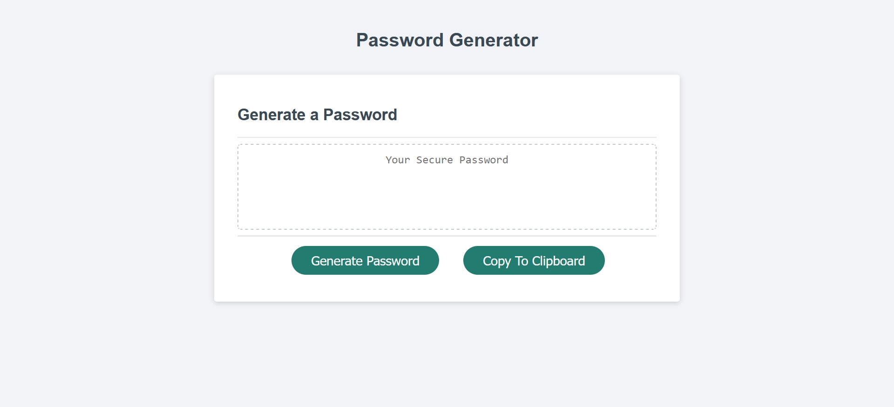
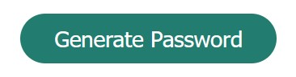
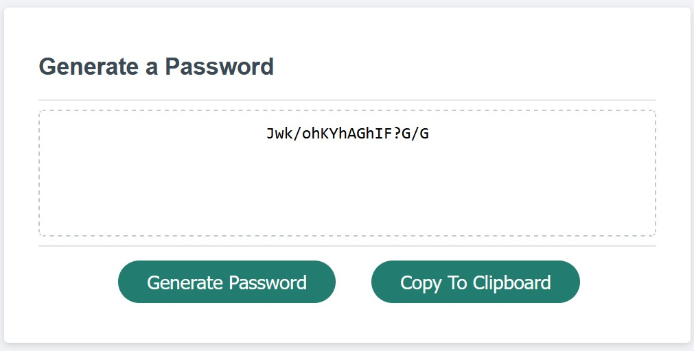
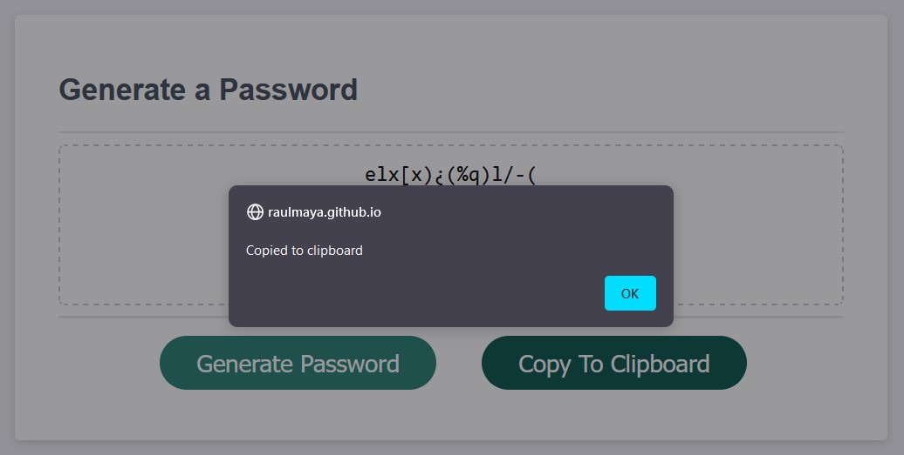

<!-- PROJECT LOGO -->
 

  

  <h2 align="center">Password Generator</h2>
  <h4 align="center">JavaScript Project</h4>

  

  This project consist in generating a password according to the user requirements. The project is developed using JavaScript, for logic and error handling. 
     
     
    <a href="https://github.com/RaulMaya/Password-Generator">Repository</a>    
    ·
    <a href="https://raulmaya.github.io/Password-Generator/">Deployment</a>
    ·
    <a href="https://www.linkedin.com/in/raul-maya/">My LinkedIn</a>

  

<!-- ABOUT THE PROJECT -->

### About The Project

1. Generate Password
 

   

   
When the user click on the generate password button the application will output several prompts for the password specifications. The prompts that the button will generate are:
   <ul>
   <li>Password Length</li>
   <li>Lowercases Usage</li>
   <li>Uppercases Usage</li>
   <li>Numeric Values Usage</li>
   <li>Special Symbols Usage</li>
   </ul>
   Once the user fill correctly the prompts, the password will be automatically generated and provided by JavaScript, parsing it on the text area.
    
       
   

2. Copy To Clipboard
 

This is a plus to the project focusing on th user experience, so they can copy in an easier way their new generated password. In other words when the user generate a password, and they click on the Copy To Clipboard Button, they will copy on their clipboard the new generated password.
           
   

### Contact :iphone:

- Name: Raul Maya Salazar
- Phone: +52 833 159 7006
- E-mail: raulmayas20@gmail.com
- GitHub: https://github.com/RaulMaya
- LinkedIn: https://www.linkedin.com/in/raul-maya/

(<a href="#top">back to top</a>)

